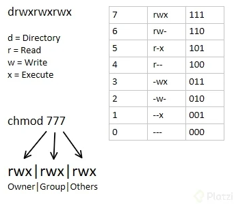
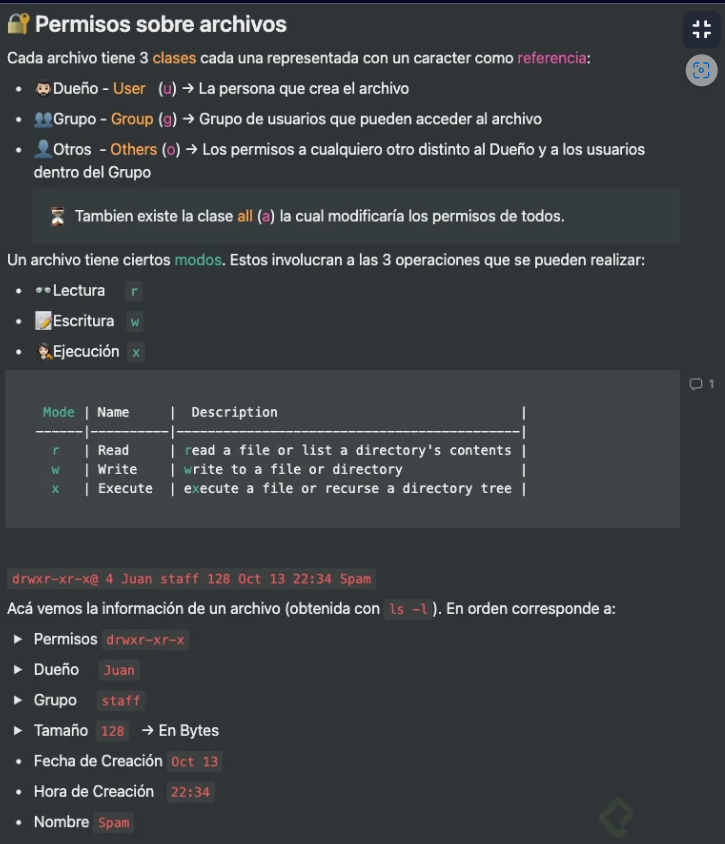
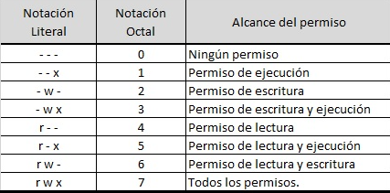
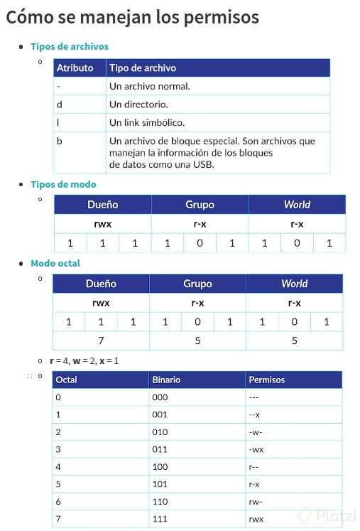
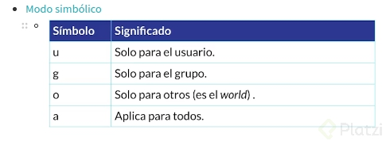

# Comandos CMD
# Clase 2
### Exploración y movimiento en la terminal.
- ````whiami````
-  ````ls````
-  ````ls -R```` : busqueda recursiva de archivos.
-  ````rm -rf [directory]```` : eliminar de forma "recursiva" y "force".
-  ````rm -i [file]```` : eliminar de forma interactiva.
-  ````pwd```` : print work directory
-  ````mkdir [directorio]````
-  ````cd```` : change directory.
-  ````file [archivo]```` : identificar el tipo y formato de un archivo.
-  Tree:

### Tree

```sudo apt install tree```

- ````tree````        # Muestra directorios y ficheros

- ````tree -d````     # Muestra sólo directorios

- ````tree -L X````   # Muestra hasta X directorios de profundidad

- ````tree -f````     # Muestra los archivos con su respectiva ruta

- ````tree -a````     # Muestra todos los archivos, incluidos los ocultos.

- ````tree /````      # Muestra un árbol de todo nuestro sistema

- ````tree -ugh````   # Muestra los ficheros con su respectivo propietario (-u),
el grupo (-g) y el tamaño de cada archivo (-h)

- ````tree -H . -o tudirectorio.html```` # Exporta tu árbol de directorio a un archivo
HTML


### manipular archivos
- ````touch```` : crea un archivo en blanco, solo lo "toca".
- ````cp [origen] [destino]```` : copiar archivos.
- ````mv [origin] [destino]```` : mover un archivo, tambien puede renombrar los archivos.
- ````head [file] -n [lineas]```` : muestras las primeras [lineas] de un archivo.
- ````cat [file] [file] [file]```` : visualizar todo el archivo.
- ````tail [file] -n [lineas]```` : muestra las ultimas [lineas] de un archivo.
- ````less [file]```` : ver el contenido de un archivo de forma interactiva, se sale con la "q", nos permite buscar un con ````/[palabra]````.
- ````explorer.exe .```` : para abrir el explorador grafico de archivos.

### Explorar comandos
- ````type [comando]```` : ver que tipo de comandos es.
- ````alias [alias]="script del comando"```` : crear un nombre para un comando.
- ````whatis [comando]```` : dice una breve descripción de los que es el comando.
- comando man: ayuda interactiva de comandos y tecnologias.
```
sudo apt update
sudo apt install man-db manpages-posix
man [comando]
```


## **Comando "Start" en windows:**
    - https://norfipc.com/comandos/como-usar-comando-start-windows-aplicaciones-practicas.php
    - https://docs.microsoft.com/en-us/windows-server/administration/windows-commands/start
    - https://www.colorconsole.de/console/es/062.htm
    

## Wildcards
- Son una serie de caracteres especiales que nos permiten realizar búsquedas muy avanzadas utilizando ls 🔍. Puedes utilizar wildcards con otros comandos que realicen manipulación de archivos como mv, cp o rm 💫. También se conocen como comodines.
- ls ````<texto>````: Nos muestra todos los archivos que tengan en su nombre dicho texto al final. Si haces ls ````<texto>*```` lo busca al final. El asterisco significa cualquier string.
- ls ````<text>?```` El signo de interrogación sustituye a cualquier carácter, por ejemplo, buscamos todos los archivos que tengan una palabra y un número dado de caracteres después. El signo de interrogación significa cualquier carácter.
- ```ls [[:upper:]]*``` Para filtrar cosas que inicien que una mayúscula; esto busca también dentro de los directorios.
- ```ls [[:lower:]]*``` Lo mismo pero con minúsculas.
- ```ls -d``` Se muestran solo directorios.
- ```ls [ad]*``` Todo lo que inicie con a o con b
- ```ls *.txt```: Lo que hace este comando es listar todos los archivos que tengan extensión .txt, independientemente del nombre que tengan.
- ```ls datos*```: Lo que hace este comando es listar todos los archivos que inicien con la palabra “datos”, independientemente de cómo siga el nombre o la extensión que tenga.
- ```ls datos?```: Lo que hace este comando es listar todos los archivos que inicien con la palabra “datos” y solamente tengan un caracter más luego de esa palabra.
- ```ls datos???```: Lo que hace este comando es listar todos los archivos que inicien con la palabra “datos” y solamente tengan tres caracteres más luego de esa palabra.
- ```ls [[:upper:]]*```: Lo que hace este comando es listar todos los archivos que inicien con una mayúscula, independientemente de cómo siga el nombre o la extensión que tenga.
- ```ls -d [[:upper:]]*```: Lo que hace este comando es listar todos los DIRECTORIOS que inicien con una mayúscula, independientemente de cómo siga el nombre que tenga.
- ```ls [[:lower:]]*```: Lo que hace este comando es listar todos los DIRECTORIOS que inicien con una minúscula, independientemente de cómo siga el nombre o la extensión que tenga.
- ```ls [ad]*```: Lo que hace este comando es listar todos los archivos que inicien con la letra “a” o con la letra “d”, independientemente de cómo siga el nombre o la extensión que tenga.
    
##  Redirecciones: Cómo funciona la shell.
    
- Normalmente, cuando pones un comando en la terminal, la salida se muestra ahí mismo, pero se puede redirigir la salida a un archivo 👀. Si la salida es correcta tiene file descriptor 1, si no, file descriptor 2.
- La entrada estándar es nuestro teclado que tiene file descriptor 0, pero también puede venir de otro lado 🧠.
- Para redirigir algo usamos >. Por ejemplo ```ls > misarchivos.txt```, entonces la salida del comando se guarda en ese archivo de texto. Siempre crea este archivo (si ya existe, lo reescribe).✍🏽
- Para que se concatene la salida en un archivo preexistente usa ```"comando" >> "archivo"```. Esto ambos solo redirigen los stdout.
- Para redirigir stderr, agregas su file descriptor ```"comando" 2> "archivo"```. 👽
- Si quiere redirigir cualquiera de las dos opciones ```"comando" >> "archivo" 2>&1```.
- Esto nos puede servir para, por ejemplo, guardar los mensajes de error que manda un servidor 🤯.
- Para redirigir stdin se usa ```<```. Esto te permite tener de entrada de comandos algún archivo.

## PipeOperator
💡Los filtros son el procesos de tomar una entrada de flujo y, realizando una conversión, es mandado a la salida de otro stream.
Hace que la salida de uno sea la entrada de otro comando ````|````.
ejemplos:
- ````ls | grep <texto>````
- ````Command 1 | command 2 | command 3 ````
- ````ls -lh | sort | cat````

## Grep
````grep```` nos permite hacer filtrado de información.
La forma generica de escribir grep es 

````grep [ExpresiónRegular] [archivoDondeBuscar]````

Pero tambien se puede hacer con PipeOperator

````ls -all | grep [ExpresiónRegular]````

### Ignorar case sensitive (-i)
Puede que queramos buscar la palabra “Action” pero eso dará exclusivamente las coincidencias con la “A” mayúscula. Esto lo podemos ignorar con la opción -i, que buscará independientemente de si la letra “A” es mayúscula o minúscula.

````grep -i Action movies.csv````

### Contar ocurrencias (-c)
Si quieres saber cuántas veces se repite una palabra, usa la opción `-c seguida de la palabra que quieres buscar.

````grep -c Drama movies.csv````

### Excluir una expresión (-v)
Para saber cuáles son los resultados que NO coinciden con tu expresión regular, usas la opción -v.

Por ejemplo, si queremos contar todas las películas que no son de drama, escribimos:

````grep -cv Drama movies.csv````


### Limitar la búsqueda (-m)
Para no buscar en todo el archivo, sino las primeras ocurrencias, podemos limitar la búsqueda en líneas con la opción -m seguida del número de líneas que queremos encontrar.

Por ejemplo, si queremos buscar las primeras 10 líneas que concuerden con la palabra “Fan” escribimos:

````grep -m 10 Fan movies.csv````


|Opción|	Función|
|--|--|
|-m	|Limita las líneas de la búsqueda|
|-c	|Cuenta las ocurrencias|
|-v	|Excluye las ocurrencias|
|-i|	Ignora él case sensitive|

## wc 
conteo de palabras en un archivo ````wc [archivp]```` da una salida de 4 banderas.

````[#lineass] [#caracteres] [#bits] [nombre_file]````

|Opción|	Función|
|--|--|
|-l	|las líneas del archivo|
|-w	|numero de palabras|
|-c	|numeros de bits|


## Operadores de control
Son símbolos reservados por la terminal que nos permiten ejecutar varios comandos seguidos, e incluso agregar condicionales ⛓️.
- Síncronos: Se corre uno detrás de otro, en orden. Se hace esto con ````;```` , por ejemplo```` ls; mkdir carpeta1````
- Asíncrono: Por cada comando, se abre una nueva terminal, y cada comando se corre de manera paralela, esto es con ````&````, por ejemplo ````ls & date & mkdir carpeta```` ⏲️
- Condicionales: Podemos agregar lógica a como se corren los comandos:

    - AND: Si se cumple un comando, entonces se ejecuta el siguiente, se usa ````&&````, un ejemplo es ````mkdir carpeta1 && cd carpeta1 && echo "Si se pudo"```` . Si no se puede ejecutar el primer comando, no se ejecuta el siguiente. 🚆
    - OR: Se ejecuta el primer comando que se pueda ejecutar, y se usa ````||````, por ejemplo ````cd carpeta || echo "No hay carpeta"````, el comando siguiente funciona si el comando anterior da con error.


## Variables de entorno
- para ver las variables de entorno
````printenv````
- ````export HOLA="Hola chicos"````
- ````$HOLA````

### Crearlas
1. a la altura del usuario creamos el archivo ````cat > .bashrc````.
2. Ingresamos los alias ````alias [ALIAS]=[COMANDO]````
3. cargamos al sistema ````source .bashrc````
4. se creará por defecto un ````.bash_profile````


## Comandos de busqueda 

### Banderas del comando find
Banderas básicas:

- ````-name````: Realiza una búsqueda por nombre de archivo.
- ``-iname``: Realiza una búsqueda por nombre de archivo sin tomar en cuenta las mayúsculas o minúsculas.
- ``-type``: Realiza una búsqueda por tipo de archivo, f(files) y d(directories) que son los más comunes.
- ``-size``: Realiza una búsqueda por el tamaño de archivo y/o directorio.
Banderas de tiempo⏰

- ``-mmin``: Búsqueda por tiempo en minutos.
- ``-mtime``: Búsqueda por tiempo en días.
Más banderas👀

- ``-maxdepth``: Después de está bandera se pone el número de niveles de profundidad en los que queremos realizar la búsqueda
- ``-empty``: Realiza una búsqueda de archivos y/o directorios vacíos.
- ``-perm``: Búsqueda de archivos por permisos.
- ``-not``: Retorna los resultados que no coinciden con la búsqueda.
- ``-delete``: Está bandera se coloca al final del comando, eliminara los resultados de la busqueda(⚠️Hay que tener mucho cuidado al usarla).

Comandos de búsqueda

- Es una de las partes mas interesantes de la terminal, ya que nos permite buscar archivos de manera eficiente y específica 💫.
- which <programa> Busca en todas las rutas del PATH para encontrar donde está alojado algún archivo binario 🔢.
- find <ruta inicial> -name <archivo> Nos permite encontrar un archivo a partir de una ruta inicial, y dentro de todas las carpetas que surjan de ese inicio 🌲.
- Algo muy cool es que podemos usar wildcards para hacer mas eficiente la búsqueda 🔍.
- ``find <ruta inicial> -type <tipo> -name <nombre>`` podemos especificar el tipo de archivo, d → directorio, f → documento.
- ````find <ruta inicial> -size <tamaño><unidad> ````podemos buscar tamaños mayores a un determinado tamaño, por ejemplo, de 20M (megas).
- Solución al reto:```` find ./ -name *.txt -type f -size 1M > mis_archivos_texto.txt | echo "archivos guardadados exitosamente"````

### Ejemplos

````
Búsqueda de archivos vacíos a partir del directorio actual.
find . -type f -empty

Buscar todos los archivos de tipo directorio de profundidad 2
find ./ -maxdepth 2 -type d 

find ./ -maxdepth 2 -name *.txt

find ./ -maxdepth 2 -type d -name Doc*

````


## Premisos
|Atributo|	Tipo de archivo|
|--|--|
|-|	Es un archivo normal, como un documento de texto, una foto, un video, etc.
|d|	Por directory es un directorio
|l|	Es un enlace simbólico. Es algo que veremos en próximas clases
|b|	Bloque especial, son archivos que manejan información para el sistema, como la información de un disco duro

|Símbolo|Significado	|Permiso|
|--|--|--|
|r|	readable|	Significa que puede leer su contenido
|w|	writable|	El usuario puede editar el contenido del archivo, también el nombre y los permisos
|x|	executable|	El usuario puede ejecutarlo en caso de que sea un pr







### Ejemplo
- ````chmod [PERMISOS] [FILE/DIRECTORY]````
- ````chmod [simboloDelUsuario][operador][permiso] [archivoParaCambiarSusPermisos]````
- ````chmod u-x,go=x [file]````

## Utilidades de red
$ ````ifconfig / ipconfig```` // sirve para ver la mascara de red, puerto de transmisión, tarjeta de red, etc

$ ````ping```` // nos muestra si una ip o pagina, esta activa, si salen paquetes es porque hay conexión.

Para evitar el ciclo “infinito” de ````ping````, es posible usar la flag/opción ````-c```` junto al número de envíos que se quieren hacer:
````ping -c 4 www.google.com````

Especificar el tamaño de los paquetes (-s)
Para probar la conectividad con paquetes de diferentes tamaños se utiliza la opción -s seguido del tamaño del paquete que desees usar. El tamaño debe ser en bytes.

Para hacer pruebas con paquetes de 20 bytes escribimos:

````ping -s 20 www.google.com````

$ ````curl [pagina_web]````  // podemos traer el html de una pagina, podríamos guardarlo con el estándar output.

$ ````wget [pagina_web]```` (linux) // nos descarga el archivo html, pero con formato.

$ ````traceroute [pagina_web]```` (linux) // nos sirve para ver por cuales computadoras tenemos que ir pasando para llegar por ejemplo a una pagina web. Ejemplo, nos saldrán las ip que tenemos que pasar para llegar a la pagina que queremos.

$ ````netstat –i```` // nos muestra los dispositivos de red.


$ ````nc -zv endpoint port````
Existe un comando que se puede usar para verificar el acceso a un puerto desde una máquina

## Comprimiendo archivos

````tar [opciones] [nombreDelArchivoComprimido] [archivoAComprimir]````

### comprimir (-c)
Para comprimir un archivo utilizamos la opción ````-c````. En todos los casos hay que usar la opción ````-f```` para indicar que estamos comprimiendo o descomprimiendo archivos.

### Ver lo que está haciendo el comando (-v)
Si queremos ver lo que el comando está comprimiendo a medida que se va ejecutando, usamos la opción ````-v````. Por cierto la opción -v es de “Verbose” y muchos comandos la usan, también te la puedes encontrar como ````--verbose````.

````tar -cvf compressed.tar Documents/toCompress/````

### Comprimir con formato “.tar.gz” (-z)
El formato “.tar.gz” o también “.tgz” es una versión extendida del formato tradicional de compresión “.zip” que puede manejar y comprimir archivos más grandes.

Para manejar la compresión de archivos “.tar.gz” o “.tgz” se usa la opción ````-z```` además de tener que especificar en el nombre de archivo la extensión que quieres usar.

````tar -czvf compressed.tar.gz Documents/toCompress/````

### Descomprimir (-x)
Para descomprimir es mucho más sencillo, solo hay que especificar la opción -x y el archivo comprimido que se quiere descomprimir.

Si se quiere descomprimir un archivo de extensión “.tar.gz” o “.tgz” hay que especificar la opción -z también.

````tar -xzvf compressed.tar.gz````

#### Comprimiendo archivos .zip
Para comprimir usamos el comando zip con el nombre que quieres que tenga y lo que quieres comprimir.

Si quieres comprimir una carpeta con archivos dentro, tienes que especificar la opción -r de “recursive”.

````zip -r copressed.zip Documents/toCompress/````

Y para descomprimir es incluso más fácil, solo escribe el comando unzip seguido de lo que quieres descomprimir.

````unzip compressed.zip````


|Opción	|Función|
|--|--|
|c|	Comprimir
|x|	Descomprimir
|z|	Especifica que lo que se va a comprimir o descomprimir tiene extensión “.tar.gz” o “.tgz”
|v|	Muestra lo que está comprimiendo o descomprimiendo

## Manejo de procesos

|Comando|	Función|
|--|--|
|ps|	Muestra una tabla con los procesos que se están ejecutando
|top|	Muestra una interfaz con los procesos que se están ejecutando más los recursos que consumen información adicional
|kill|	Mata el proceso que le indiques


- Les recomiendo ````htop```` tiene una interfaz mucho más amigable, lo pueden descargar con: ````sudo apt install htop```` y para entrar al programa solo utilizan el comando htop

```
Quienes usan WSL: RECUERDA que estos comandos que nos enseño el profesor, nos mostrará solo lo que tenemos en UBUNTU, no más. Es decir no nos mostrará los procesos que estemos haciendo en Windows, porque Windows no se lo permite, cuando nos encontremos en un sistema Linux si lo hará. 😃 😃
```

$ ````pkill -nombre````

Acabas con el proceso usando el nombre en lugar del id. pkill firefox
También puedes usar

$ ````killall -nombre_del_proceso````

Cuando se traba nuestro OS, normalmente terminamos procesos con el administrador de tareas 😆, en la terminal se puede hacer, pero es un poco diferente.
$ ````ps```` nos muestra los procesos que están corriendo actualmente. Cada proceso tiene un PID. Podemos ver los procesos que estén en el background (por ejemplo, CAT).
$````kill <PID>```` nos ayuda a terminar procesos fuera de nuestra terminal. 🛑
$ ````top <PID>```` nos muestra los procesos que están usando más recursos de nuestra computadora. Podemos filtrar los procesos (para ver como, usamos bandera h → help). 🆘
La terminal, sabiéndola usar bien, es más eficiente que el administrador de tareas.
$````htop```` es como top pero con esteroides. Debemos instalarlo. Tiene muchas más opciones 💪🏽

```
ps ax, para ver los procesos del sistema.

top muestra los proceso en tiempo real

kill -9 pid, para terminar el proceso inmediatamente.

killall -9 proceso, para terminar el proceso.
```

## Procesos en foreground y background


### ejercicio:
- cat > mi_nota.txt
- CTRL+Z
- jobs
- fg 1

### Otras formas de enviar al background
- Existen otras formas de enviar comandos al background. La primera es usando el operador de control```` &````  al final de un comando. Este operador nos permite enviar de manera directa un proceso al background una vez ejecutado. Por ejemplo: ````cat > mi_nota.txt &````

- Existen otras formas de enviar comandos al background. La primera es usando el operador de control & al final de un comando. Este operador nos permite enviar de manera directa un proceso al background una vez ejecutado. Por ejemplo: ````bg 1````

#### otro
¿Cómo manejar procesos?
Diferencia entre ````Ctrl + C```` y ````Ctrl + Z````
````Ctrl + C```` Lo que hace es que finaliza o mata un proceso.
````Ctrl + Z```` Lo que hace es que pausa o suspende un proceso con lo que después lo podremos volver a llamar con el comando ````fg foreground (primer plano)```` o con el comando```` bg background (segundo plano)````
Y un ejemplo muy sencillo que les servirá para controlar procesos es el siguiente:
.
Crear un listado recursivo (Que liste todos los archivos y directorios)
Para eso seguimos los sigueintes pasos:

1.  Primero hacemos el comando cd / para dirigirnos a la raíz de nuestro sistema.
2. Después ejecutamos el comando ls -R y comenzará a listar TODO lo que existe dentro de nuestro S.O.
3. Ahora lo que hacermos será confirmar lo aprendido, utilizamos Ctrl + C y veremos que se cancela el proceso, pero lo interesante viene cuando hacemos lo siguiente 😄
4. Ahora ejecutamos el mismo comando para listar TODO, ls -R y lo detenemos con Ctrl + Z a lo que nos saldrá lo siguiente: [Número del proceso] + Id del proceso + En donde se detuvo el proceso
Y se verá algo como esto:```` [1] + 40751 suspended (signal) ls --color=tty -R````
Y repetiremos el paso 4 otras 3 veces (Ustedes confíen 😄)
Ahora si ejecutamos el comando jobs nos mostrará todos los procesos suspendidos y si tenemos ejecutando alguno en segundo plano.
Imgur
Para volver a activar algún proceso podemos hacerlo con el comando fg %Número del proceso
Por ejemplo en bash con fg %1 y en zsh con fg %1 para volver a correr el primer proceso que suspendimos, y ahora le damos Crl + C para ahora sí matarlo, ahora el proceso 1 ya no existirá al ejecutar jobs pero el 2, 3 y 4 ahí seguirán 😄

Esto es muy importante para cuando queremos manejar diferentes procesos, por ejemplo con el comando ````sleep 10000 &```` podrá un proceso en segundo plano, entonces no lo podremos ver, pero nos marca el Número del proceso entre los ````[]```` también lo podemos ver con ````jobs```` junto con su número de proceso, si lo queremos traer a primer plano lo podemos hacer con el comando fg %1 por ejemplo y de ahí ya cancelarlo o suspenderlo, o una manera más rápida, solo ejecutar el comando ````kill %Número del proceso```` por ejemplo: con el mismo ejemplo de sleep 10000 & si nos da el [1] lo podremos terminar con ````kill 1```` o ````kill %1```` y nos saldrá algo como ````[1] + 41723 terminated sleep 10000```` y ahora ya saber como manejar y exterminar todos los procesos como terminator 🤖
.
.
Diferencia entre ````Ctrl + L```` y ````clear````
````Ctrl + L```` Lo que hace es que manda para arriba lo que está impreso en la terminal, dejándola a simple vista limpia, pero en realidad lo puedes regresar a eso que esta impreso ahí.

````clear```` Lo que hace es que limpia la terminal, y todo lo que estaba impreso en la terminal.

## Editores de texto en la terminal

Una de las utilidades más importantes de la terminal es el editor de texto. Hay diferentes opciones, pero Vim es uno de los más sencillos y populares. También está Emacs y Nano 🤔. Veamos con más detalle el uso de Vim.

````vim [nombre del archivo]````
- Por defecto no podrás escribir hasta que actives el modo de inserción. Para hacerlo usa la tecla i.

- Para salir del modo de inserción presiona la tecla escape. En el modo normal (en el que no puedes escribir) si escribes el slash / activarás un buscador similar al del comando less.
- Para borrar una línea, estando el modo normal, tienes que ubicarte sobre ella y presionar dd.
- Para guardar y salir presiona estando en el modo normal, activa los comandos usando : y escribe “wq”. La letra “w” es para guardar y la letra “q” es para salir, también los puedes usar por separado.

|Comando|	Función|
|--|--|
|vim|	Abre el archivo especificado. Si no existe lo crea
|:q|	Cierra el editor
|:w|	Guarda los cambios
|/búsqueda]|	Busca dentro del texto
|dd|	En el modo normal, selecciona una línea y la borra

- Si quieres practicar VIM en tu misma Terminal, ejecuta el siguiente programa que ya viene incorporado.````vimtutor````