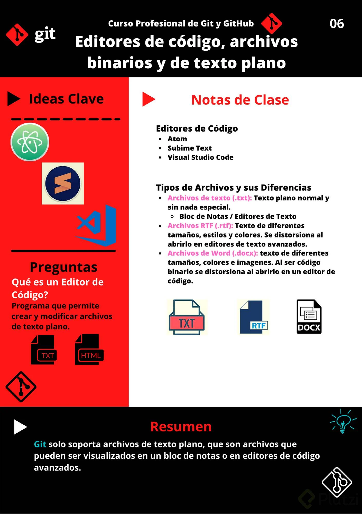
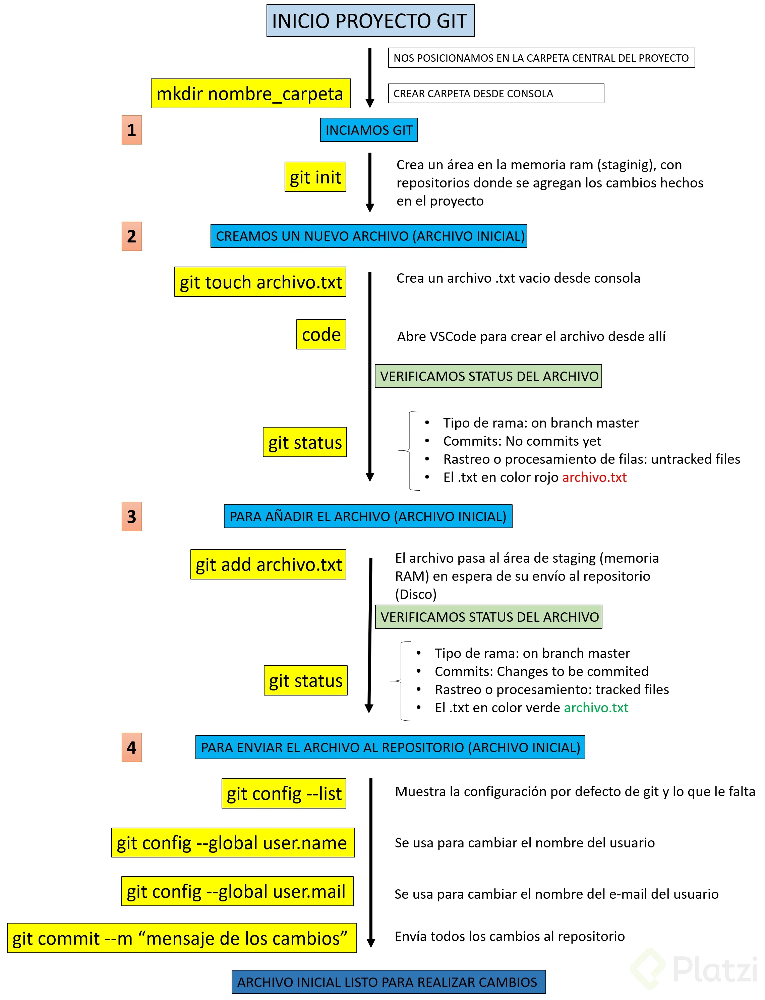

# GIT


## Editor de texto
Un editor de código o IDE es una herramienta que nos brinda muchas ayudas para escribir código, algo así como un bloc de notas muy avanzado. Los editores más populares son VSCode, Sublime Text y Atom, pero no es obligatorio usar alguno de estos para programar. Conoce más a fondo sobre qué es un IDE.

### Tipos de archivos y sus diferencias:
Archivos de Texto (.txt): Texto plano normal y sin nada especial. Lo vemos igual sin importar dónde lo abramos, ya sea con el bloc de notas o con editores de texto avanzados.
Archivos RTF (.rtf): Podemos guardar texto con diferentes tamaños, estilos y colores. Pero si lo abrimos desde un editor de código, vamos a ver que es mucho más complejo que solo el texto plano. Esto es porque debe guardar todos los estilos del texto y, para esto, usa un código especial un poco difícil de entender y muy diferente a los textos con estilos especiales al que estamos acostumbrados.
Archivos de Word (.docx): Podemos guardar imágenes y texto con diferentes tamaños, estilos o colores. Al abrirlo desde un editor de código podemos ver que es código binario, muy difícil de entender y muy diferente al texto al que estamos acostumbrados. Esto es porque Word está optimizado para entender este código especial y representarlo gráficamente.
Recuerda que debes habilitar la opción de ver la extensión de los archivos, de lo contrario, solo podrás ver su nombre. La forma de hacerlo en Windows es Vista > Mostrar u ocultar > Extensiones de nombre de archivo.



## Conceptos importantes de Git
- **Bug**: Error en el código

- **Repository**: Donde se almacena todo el proyecto, el cual puede vivir tanto en local como en remoto. El repositorio guarda un historial de versiones y, más importante, de la relación de cada versión con la anterior para que pueda hacerse el árbol de versiones con las diferentes ramas.

- **Fork**: Si en algún momento queremos contribuir al proyecto de otra persona, o si queremos utilizar el proyecto de otro como el punto de partida del nuestro. Esto se conoce como “fork”.

- **Clone**: Una vez se decide hacer un fork , hasta ese momento sólo existe en GitHub. Para poder trabajar en el proyecto, toca clonar el repositorio elegido al computador personal.

- **Branch**: Es una bifurcación del proyecto que se está realizando para anexar una nueva funcionalidad o corregir un bug.

- **Master**: Rama donde se almacena la última versión estable del proyecto que se está realizando. La rama master es la que está en producción en cada momento (o casi) y debería estar libre de bugs. Así, si esta rama está en producción, sirve como referente para hacer nuevas funcionalidades y/o arreglar bugs de última hora.

- **Commit**: consiste en subir cosas a la versión local del repositorio. De esta manera se puede trabajar en la rama de forma local sin tener que modificar ninguna versión en remoto ni tener que tener la última versión remota, cosa muy útil en grandes desarrollos trabajados por varias personas.

- **Push**: Consiste en enviar todo lo que se ha confirmado con un commit al repositorio remoto. Aquí es donde se une nuestro trabajo con el de los demás.

- **Checkout**: Acción de descargarse una rama del repositorio GIT local (sí, GIT tiene su propio repositorio en local para poder ir haciendo commits) o remoto.

- **Fetch**: Actualiza el repositorio local bajando datos del repositorio remoto al repositorio local sin actualizarlo, es decir, se guarda una copia del repositorio remoto en el local.

- **Merge**: La acción de merge es la continuación natural del fetch. El merge permite unir la copia del repositorio remoto con tu repositorio local, mezclando los diferentes códigos.

- **Pull**: Consiste en la unión del fetch y del merge, esto es, recoge la información del repositorio remoto y luego mezcla el trabajo en local con esta.

**Diff**: Se utiliza para mostrar los cambios entre dos versiones del mismo archivo.


## Git primeros pasos

Le indicaremos a Git que queremos crear un nuevo repositorio para utilizar su sistema de control de versiones. Solo debemos posicionarnos en la carpeta raíz de nuestro proyecto y ejecutar el comando:

````
git init
````
Recuerda que al ejecutar este comando (y de aquí en adelante) vamos a tener una nueva carpeta oculta llamada .git con toda la base de datos con cambios atómicos en nuestro proyecto.

Recuerda que Git está optimizado para trabajar en equipo, por lo tanto, debemos darle un poco de información sobre nosotros. No debemos hacerlo todas las veces que ejecutamos un comando, basta con ejecutar solo una sola vez los siguientes comandos con tu información:

````
git config --global user.email "tu@email.com"
git config --global user.name "Tu Nombre"
````
Existen muchas otras configuraciones de Git que puedes encontrar ejecutando el comando ````git config --list```` (o solo ````git config```` para ver una explicación más detallada).

Si quieres ver los archivos ocultos de una carpeta puedes habilitar la opción de Vista > Mostrar u ocultar > Elementos ocultos (en Windows) o ejecutar el comando ls -a.

### Comandos para iniciar tu repositorio con Git
- ````git init````: para inicializar el repositorio git y el staged
- ````git add nombre_del_archivo.txt````: enviar el archivo al staged
- ````git status```` : ver el estado, si se requiere agregar al starget o si se requiere commit
- ````git conf````: para ver las posibles configuraciones
- ````git conf --list````: para ver la lista de configuraciones hechas
- ````git conf --list --show-origin````: para mostrar las configuraciones y sus rutas
- ````git rm --cached nombre_del_archivo.txt````: para eliminar el archivo del staged(ram)
- ````git rm nombre_del_archivo.txt````: para eliminar del repositorio.


Si por algún motivo te equivocaste en el nombre o email que configuraste al principio, lo puedes modificar de la siguiente manera:

````
git config --global --replace-all user.name “Aquí va tu nombre modificado”
````
O si lo deseas eliminar y añadir uno nuevo
````
git config --global --unset-all user.name :Elimina el nombre del usuario
git config --global --add user.name “Aquí va tu nombre”
````




## Analizando cambios
El comando **````git show````** nos muestra los cambios que han existido sobre un archivo y es muy útil para detectar cuándo se produjeron ciertos cambios, qué se rompió y cómo lo podemos solucionar. Pero podemos ser más detallados.

Si queremos ver la diferencia entre una versión y otra, no necesariamente todos los cambios desde la creación del archivo, podemos usar el comando **````git diff commitA commitB````**.

Recuerda que puedes obtener el ID de tus commits con el comando **````git log````**.